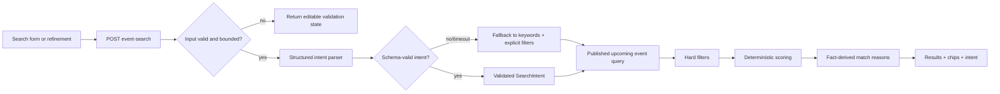
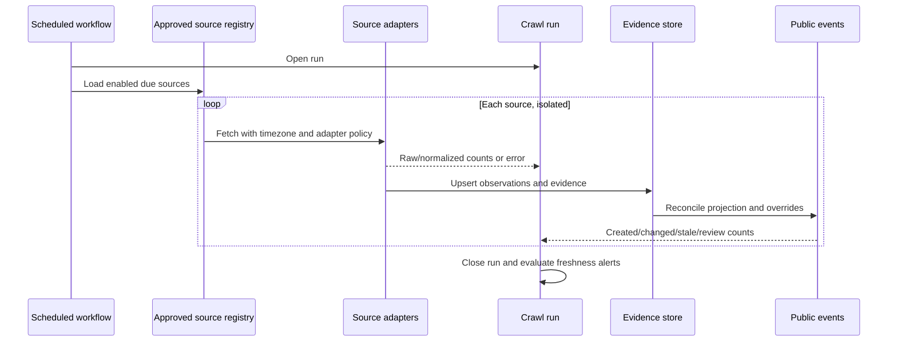
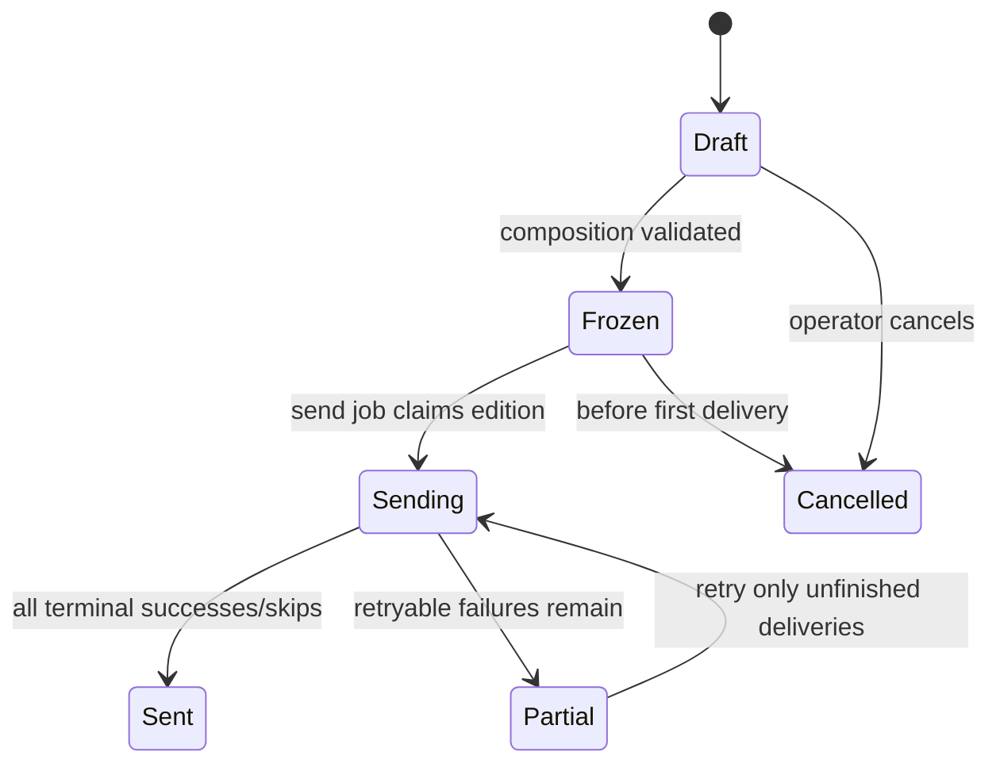
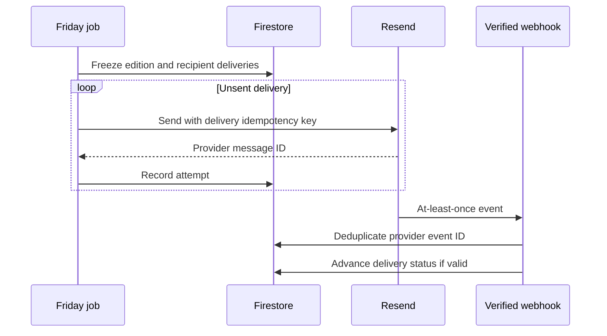

# Westfield Buzz Release One

## Summary

Release One turns Westfield Buzz from a directory-led prototype into a trustworthy, events-first guide to Westfield and nearby towns. The public product has three simple entry points: browse this week, open the full calendar, or describe what you want in natural language. An account is optional. Signing in adds saved events, saved searches, household preferences, and a personalized Friday email; an anonymous email subscriber receives the generic edition.

The hard product problem is not a conversational interface. It is maintaining an accurate local event inventory whose changed times, cancellations, source provenance, and last verification are visible. The AI layer is deliberately narrow: it converts a sentence into a validated search intent. Firestore queries and deterministic application logic filter and rank actual event records. The model never creates event facts or decides whether an event exists.

The approved visual direction is captured in [`concepts/search-first.html`](../../concepts/search-first.html) and the release-one screenshots under [`concepts/screenshots/release-one/`](../../concepts/screenshots/release-one/). The interface keeps the existing watercolor art, Instrument Serif/DM Sans typography, paper/navy/gold palette, and editorial voice while removing the directory from primary product navigation.

## Problem Frame

People around Westfield can already find businesses in Maps or Yelp. What remains difficult is answering a time-sensitive question such as “What can I do with a five-year-old Saturday morning, indoors, within 15 minutes?” across fragmented municipal calendars, libraries, schools, venues, and newsletters. Existing sources are incomplete, inconsistent, and frequently change after publication.

Westfield Buzz wins only if it does three things together:

1. Maintains a broader, fresher approved-source event inventory than a person can assemble manually.
2. Makes that inventory easy to scan as a weekly agenda and full calendar.
3. Lets a user express messy intent naturally without forcing them into either a filter maze or a chatbot transcript.

Wrong event facts are more damaging than thin coverage. Source health, reconciliation, human review, and visible freshness are therefore first-release behavior, not later operational polish.

## Goals and Success Criteria

- A visitor can understand what is happening this week and reach the first event without signing in.
- A visitor can search in a sentence, see the interpreted constraints, edit them, and receive only source-backed event results.
- A visitor can open a full calendar and a source-backed event detail page even if the AI service is unavailable.
- Approved sources refresh daily without creating duplicate events or silently preserving changed/cancelled facts.
- An anonymous subscriber can receive and unsubscribe from the generic Friday edition.
- A signed-in user can save events/searches, set household preferences, and receive a personalized Friday edition.
- Operators can distinguish healthy, failing, stale, and awaiting-review sources and can trace each displayed event to its evidence.

## Requirements

### User experience

- **R1 — Events-first home:** `/` presents the current week around Westfield, a compact natural-language search, the first chronological day group above or near the desktop fold, and the Friday email promise. It does not lead with a business directory.
- **R2 — Full calendar:** `/events` supports agenda and calendar views, previous/next and Today navigation, date selection, category filtering, meaningful empty states, and mobile-friendly date navigation.
- **R3 — Natural-language search:** A user can submit one request such as “free live music Friday night near Cranford,” then see matched events plus editable structured chips. A follow-up is a single refinement field that updates the same search state; the product does not render a long chat history.
- **R4 — Transparent matching:** Every result states why it matched using only normalized event fields and parsed constraints. The user can remove or change a constraint without rewording the whole sentence.
- **R5 — Event detail:** Each event has a canonical detail route with time, venue, town, availability/status, cost, ages/audience, source link, last-verified time, calendar export, share, and save.
- **R6 — Trust states:** The UI distinguishes scheduled, changed, cancelled, sold out, waitlist, weather dependent, stale, and draft events where applicable. Cancelled or materially changed events are never silently presented as normal.
- **R7 — Anonymous parity:** Browsing, calendar navigation, natural-language search, source links, sharing, calendar export, generic email signup, and unsubscribe require no account.

### Identity and personalization

- **R8 — Optional sign-in:** Google and passwordless email-link sign-in are available only when a user chooses to save or personalize. Authentication returns the user to the interrupted action. Facebook is not promoted or required in public UX.
- **R9 — Saved state:** A signed-in user can save/unsave events and searches. Save writes are idempotent, user-owned, and cannot drift a public counter.
- **R10 — Household preferences:** A signed-in user can store towns or drive-time tolerance, interests, age ranges, budget, timing, indoor/outdoor preference, accessibility needs, and email personalization choice. Every preference is optional and editable.
- **R11 — Two email modes:** An email-only subscriber receives a generic Friday edition. A signed-in user who opts into personalization receives a preference-ranked edition, with a generic fallback when preferences or matching inventory are insufficient.

### Event truth and freshness

- **R12 — Approved-source boundary:** Scheduled collection reads only an explicit registry of approved sources. New source discovery creates candidates for human approval; it never expands the production crawl automatically.
- **R13 — Reconciliation:** Repeated collection upserts stable source records, updates changed fields, records evidence and last-seen time, detects likely removals, and applies a source-specific grace policy before marking a missing event stale. An explicit source cancellation marks the event cancelled immediately.
- **R14 — Provenance:** Every published event has at least one source record, canonical source URL when available, fetch timestamp, source-local identifier or deterministic fingerprint, and a last-verified timestamp.
- **R15 — Publication policy:** First-party CivicPlus and LibCal sources may auto-publish after validation. Aggregators, ambiguous parses, and newly discovered sources remain draft until reviewed. Manual operator edits are preserved through subsequent crawls unless explicitly released.
- **R16 — Failure isolation:** One source failure does not discard successful source updates. Each run records per-source outcomes, counts, durations, and errors, and alerts when a source passes its freshness threshold.

### Email and operations

- **R17 — Safe delivery:** Friday editions are frozen before sending, deliveries are idempotent per recipient and edition, provider webhooks are verified and deduplicated, unsubscribe takes effect immediately, and partial failures can be retried safely.
- **R18 — Observable automation:** Daily collection, Friday composition/send, and monthly source discovery expose run status and a human-readable failure trail without relying on local machines.
- **R19 — Privacy:** Search text may be used ephemerally to produce results without an account. Persisted searches, preferences, saved events, and personalized-delivery data are private to the signed-in user. Logs avoid raw personal search text and provider secrets.
- **R20 — Responsive/accessibility quality:** The release-one flows work at 390px and desktop widths, preserve visible keyboard focus, use tap targets of at least 40px, maintain semantic headings and labels, and avoid 16px-subminimum text inputs on iOS.

## Scope Boundaries

### In scope

- Events-first homepage, full calendar, search results, event detail, email signup, authentication, preferences, saves, and unsubscribe surfaces.
- Current approved CivicPlus/LibCal feeds plus approved first-party school and venue feeds for the initial nearby-town set.
- Daily source reconciliation, run records, staleness policy, and a bounded review queue.
- Generic and personalized Friday digest using Firestore, React Email, and Resend.
- Redirecting or de-emphasizing legacy directory routes without deleting their underlying data.

### Out of scope

- A Yelp-style business directory as a primary product surface.
- A long-form conversational assistant, persistent transcript, or agent persona.
- Open web crawling, unsupervised source enrollment, or public “add event” submission.
- Social coordination, public interested counts, comments, messaging, referrals, ads, or organizer accounts.
- Model-generated event facts, generated summaries that cannot be traced to source text, or AI-only ranking.

### Deferred

- Vector or embedding retrieval. The first-release corpus can be date-bounded and scored deterministically after intent parsing.
- Live community reports, organizer verification, commute-aware routing, and map-first exploration.
- Fully automated source discovery. Monthly discovery remains a candidate-generation job with human approval.

## Context and Research

### Repository reality

- The application is a single Next.js 16 App Router project under `app/`, with React 19, TypeScript, Tailwind 4, Firebase Auth/Firestore, Vitest, and Vercel hosting.
- Public pages currently query Firestore from the browser. There are no API routes, scheduled workflows, email provider modules, AI SDKs, or standard Playwright script.
- The current event schema is too thin for trustworthy filtering. Category labels differ among the UI, admin, and ingester. `town` is written by ingestion but absent from the TypeScript event interface.
- The ingester is append-only: an existing source ID is skipped, so changed time, cancellation, and freshness cannot propagate. `autoApprove` is declared but not enforced.
- The current Interested flow performs two sequential writes; user rules allow the user document but deny the public event count update. Release One replaces this with a user-owned saved-event record.
- `projectplan.md` and the create-next-app README are stale. The product source of truth is the current conversation, the release-one concept, and [`docs/ideation/2026-08-19-westfieldbuzz-local-life-ideation.md`](../ideation/2026-08-19-westfieldbuzz-local-life-ideation.md).

### External constraints that shape the design

- The OpenAI Responses API supports schema-constrained output, allowing search intent to be validated before it touches retrieval. The default model should be configurable and start with GPT-5.6 Luna for high-volume intent parsing; an evaluation set, not model reputation, controls whether a stronger fallback is necessary. See [GPT-5.6 Luna](https://developers.openai.com/api/docs/models/gpt-5.6-luna), [model selection guidance](https://developers.openai.com/api/docs/guides/latest-model), and [Responses structured output](https://developers.openai.com/api/reference/java/resources/beta/subresources/responses).
- Firebase email-link authentication requires authorized-domain and redirect handling, so the mobile and deployed-domain round trip must be tested rather than mocked only. See [Firebase email-link authentication](https://firebase.google.com/docs/auth/web/email-link-auth).
- The repository uses named Firestore databases, while the Web/Admin named-database API references still carry a production-preview warning. Release One must explicitly validate this deployment choice or plan a default-database migration rather than deepening an unacknowledged dependency. See the [Firebase Web Firestore reference](https://firebase.google.com/docs/reference/js/firestore_) and [Admin Firestore reference](https://firebase.google.com/docs/reference/admin/node/firebase-admin.firestore).
- Resend idempotency keys have a bounded retention window; webhook delivery is at least once and ordering is not guaranteed. Westfield Buzz therefore needs its own edition/delivery state and webhook-event deduplication. See [Resend idempotency](https://resend.com/docs/dashboard/emails/idempotency-keys), [webhooks](https://resend.com/docs/webhooks/introduction), and [unsubscribe headers](https://resend.com/docs/dashboard/emails/add-unsubscribe-to-transactional-emails).
- Vercel Cron keeps production schedules and secrets beside the deployed application. Protected Route Handlers must keep each source group within the configured function duration, express schedules in UTC, persist a Firestore lease/run ledger, and detect missing expected runs independently of invocation logs. See [Vercel Cron Jobs](https://vercel.com/docs/cron-jobs) and [function duration](https://vercel.com/docs/functions/configuring-functions/duration).
- Compound Firestore queries require declared indexes; the event access patterns must be fixed before index creation. See [Firestore index management](https://firebase.google.com/docs/firestore/query-data/indexing).

## Key Technical Decisions

### KTD1 — AI is a bounded intent parser

The server sends the search sentence and current structured intent to a schema-constrained model call. The result is validated into `SearchIntent`; invalid, timed-out, or unavailable responses produce a deterministic fallback rather than a failed page. A follow-up replaces or merges fields in the same intent object. No transcript is needed.

Why: this preserves the familiar search mental model, keeps the product useful without the model, and makes incorrect interpretations visible and editable. A generic chatbot was rejected because it adds interaction cost without improving event truth.

### KTD2 — Retrieval and ranking are deterministic

Firestore first retrieves a bounded, published, non-stale event window. Application logic applies hard constraints (date, status, maximum distance when known, age suitability, sold-out exclusion when requested) and scores soft preferences. A model may later rerank or phrase explanations for a small candidate set, but it cannot introduce events, relax hidden constraints, or overwrite fact-derived reasons.

Why: deterministic ranking is testable, explainable, inexpensive, and safe for a small local corpus. Vector search is deferred until an evaluation demonstrates a recall gap that normalized fields and tags cannot solve.

### KTD3 — Event truth is separated from source evidence

`events` contains the canonical public projection. `eventSources` contains each source observation and normalized fields. Reconciliation matches by stable source key first, then conservative fingerprints; it recomputes the public projection while preserving explicit manual overrides. A missing observation moves through source-specific grace states rather than immediately deleting an event.

Why: one event may appear in multiple sources, sources change independently, and append-only ingestion cannot represent corrections or cancellations.

### KTD4 — Publication is policy-driven

The source registry owns adapter type, approval state, cadence, timezone, auto-publish eligibility, freshness threshold, and removal grace. First-party CivicPlus/LibCal events that validate can publish automatically. Ambiguous, aggregator-derived, or newly discovered records enter a review queue.

Why: “approved source” must be executable policy, not documentation that ingestion can bypass.

### KTD5 — Anonymous subscriptions and users are separate identities

`subscribers` is keyed by normalized-email hash and can exist without Firebase Auth. A user record stores the verified email association and personalization opt-in. On sign-in, a verified matching subscription is linked without replacing unsubscribe or delivery history.

Why: requiring an account for the Friday list would harm the simplest conversion path, while conflating email rows and auth users creates duplicate-delivery and account-deletion problems.

### KTD6 — Saves are user-owned records, not social counters

Release One replaces Interested with `users/{uid}/savedEvents/{eventId}` and `savedSearches`. No public count is maintained.

Why: the current two-write flow is broken under the rules and a counter adds social semantics that are not part of the release.

### KTD7 — Digest editions are immutable delivery inputs

A weekly composition job writes a draft edition and recipient selections. Sending atomically freezes the edition. Each delivery record has an application idempotency key, provider ID, status, and attempt history. Webhooks update delivery state using a deduplicated provider event ID.

Why: recomputing while sending can give recipients different editions and makes partial retry unsafe.

### KTD8 — Automation runs outside request/response paths

Vercel Cron invokes protected routes for daily collection, monthly discovery, and Friday composition/send with server-only secrets. CLI entry points invoke the same testable server modules for dry runs and diagnosis; Firestore leases make route retries and overlaps safe.

Why: source collection is variable-duration batch work. Keeping it out of Vercel request limits makes partial failure, retry, and logs easier to reason about.

### KTD9 — The directory is removed from discovery, not destructively erased

Primary nav, homepage copy, metadata, and internal links remove Directory. Legacy routes redirect to the events-first home or remain reachable only through an intentionally temporary compatibility path. Existing service data is not deleted during this release.

Why: the product no longer competes with Maps/Yelp, while preserving data makes rollback cheap and prevents an unrelated destructive migration.

### KTD10 — Server boundaries are explicit public APIs

Natural-language search and verified provider webhooks use Node Route Handlers. Authenticated mutations may use Server Actions or Route Handlers, but every boundary validates input and authorization next to the data operation. OpenAI, Firebase Admin, Resend, and signature logic live in `server-only` modules. Search uses POST so household-language requests are not placed in URLs or GET caches.

Why: hiding a control or checking auth in a layout does not secure a public endpoint. Node runtime boundaries also avoid accidental client bundling and Edge incompatibilities.

## High-Level Technical Design

These diagrams describe boundaries and lifecycle, not exact implementation signatures.

### Search request

The server accepts a bounded query length and a prior intent for refinement. It returns structured intent, results, reasons, ambiguity warnings, and a fallback flag. It never returns model-invented event fields.

### Daily collection and reconciliation

Successful sources commit even if another source fails. An event absent from one run is marked missing evidence; it becomes stale/cancelled only after the configured grace policy or an explicit source status.

### Friday digest lifecycle

## Data Model

| Collection | Purpose | Important fields and invariants |
| --- | --- | --- |
| `events` | Canonical public event projection | Normalized title, start/end + timezone, venue/town, geodata when known, category/tags, age/cost/environment/accessibility, registration/availability/status, canonical URL, last verified, publication state; published events have evidence. |
| `eventSources` | One source observation for an event | Source key, source event ID/fingerprint, URL, fetched/first-seen/last-seen, raw evidence hash, normalized fields, parse confidence, missing state. Unique on source + source identity. |
| `sourceRegistry` or code registry | Executable source policy | Approved/enabled, adapter, timezone, cadence, auto-publish, freshness/removal thresholds. Production jobs cannot fetch outside it. |
| `crawlRuns` and source results | Operational ledger | Started/finished, workflow ID, per-source status/counts/duration/error class, aggregate result. Raw secrets and full HTML are excluded. |
| `reviewCandidates` | Human-gated events/sources | Candidate type, evidence link, confidence/reason, review state, reviewer/audit timestamps. |
| `subscribers` | Accountless and linked email identity | Email hash, encrypted/provider-safe email value, status, consent/source/timestamps, unsubscribe token version, optional user link. One active recipient per normalized email. |
| `users/{uid}` | Private account/preferences | Household preferences, email personalization opt-in, verified subscriber link, schema version. |
| `users/{uid}/savedEvents` | Private event saves | Event reference and saved timestamp. Document ID is the event ID for idempotency. |
| `users/{uid}/savedSearches` | Private reusable intents | User label, normalized `SearchIntent`, created/updated timestamps. Raw text is optional and off by default. |
| `digestEditions` | Frozen weekly content | Week/timezone, generic content, lifecycle state, frozen timestamp, inventory snapshot references. |
| `digestDeliveries` | Recipient-specific send state | Edition + recipient unique key, personalized event IDs, idempotency key, attempts, provider ID, terminal status. |
| `webhookEvents` | Provider deduplication | Provider event ID, received timestamp, type, delivery reference; create-once semantics. |

Existing event documents require an additive normalization/backfill. Readers tolerate legacy records during the migration, but publishing and search operate only on records that meet the new minimum evidence contract.

## Implementation Units

### U1 — Canonical event domain and reconciliation foundation

**Goal:** Establish one testable event contract and replace append-only ingestion with evidence-backed upsert/reconciliation before new discovery surfaces depend on it.

**Requirements:** R6, R12–R16, R18, R19.

**Dependencies:** None. This is the foundation for U2, U3, U5, U6, and U7.

**Files:**

- Modify `app/src/lib/firestore.ts`, `app/src/lib/event-categories.ts`, `app/scripts/ingest-events.ts`, `app/scripts/event-sources.ts`, `app/firestore.rules`, and `app/firebase.json`.
- Add `app/src/lib/events/types.ts`, `normalize.ts`, and `query.ts`.
- Add server-only modules under `app/src/lib/server/ingestion/` for adapters, reconciliation, evidence, and run state.
- Add `app/firestore.indexes.json`.
- Add parser fixtures and reconciliation tests under `app/src/lib/server/ingestion/__tests__/` plus event-domain tests under `app/src/lib/events/__tests__/`.

**Approach:**

- Define one category taxonomy and compatibility normalization for legacy/admin/source labels.
- Add the search/trust fields from the data model with explicit unknown values rather than guessed defaults.
- Keep adapter parsing pure; pass normalized observations to a reconciliation service.
- Match by source identity first. Use a conservative title/start/venue fingerprint only within the same source when IDs are absent. Cross-source merging starts as reviewable, not automatic.
- Record manual overrides separately from source fields so a subsequent crawl cannot erase them.
- Model missing observations as seen → missing-within-grace → stale, with explicit source cancellation taking precedence.
- Backfill existing events in a dry-run/report-first script and retain a rollback export/reference.

**Tests and verification:**

- Same source ID with a changed start time updates one event and records the old/new evidence; it does not insert a duplicate.
- A source-declared cancellation immediately produces a cancelled public state.
- One missing crawl preserves the event within grace; repeated absence after threshold marks it stale without deleting evidence.
- A manual venue correction survives a subsequent source refresh while non-overridden source fields update.
- One source parser failure closes that source result as failed while successful sources reconcile and the overall run is partial.
- Naive source timestamps are interpreted using registry timezone across DST boundaries.
- Invalid events remain draft with a review reason and never appear in the public query.
- Dry-run reports create/update/stale/review counts without Firestore writes.

**Observable outcome:** Running ingestion twice over controlled fixtures is idempotent; changed and cancelled fixtures alter the existing canonical record; a crawl run clearly identifies source health and every published fixture has provenance.

### U2 — Events-first public experience

**Goal:** Implement the approved homepage, calendar, event cards, and detail flow without requiring an account or AI service.

**Requirements:** R1, R2, R5–R7, R20.

**Dependencies:** U1 event contract and public query.

**Files:**

- Modify `app/src/app/page.tsx`, `app/src/app/events/page.tsx`, `app/src/components/Nav.tsx`, `Footer.tsx`, `EventCard.tsx`, `EventCalendar.tsx`, `app/src/app/globals.css`, `layout.tsx`, `sitemap.ts`, and `robots.ts`.
- Modify `app/src/app/privacy/page.tsx` so it describes event search, model processing, household preferences, email delivery, retention/deletion, and the fact that preferences about children are supplied by adults rather than accounts for children.
- Add `app/src/app/events/[id]/page.tsx` and focused detail/status/calendar-export components.
- Modify legacy directory and suggestion route pages to redirect or display an intentional compatibility notice.
- Extend component/page tests and add a Playwright release-one public-flow spec.

**Approach:**

- Use server-side event reads for initial public content where practical, with bounded queries rather than loading all events into the browser.
- Keep one chronological day-group system for the weekly agenda. Editorial weekend picks may decorate but never replace Friday–Sunday inventory.
- Render clear loading, error, no-events, filtered-empty, stale, cancellation, waitlist, sold-out, and weather-dependent states.
- Make every card link to a canonical detail page. Display source and last verification without overwhelming the card.
- Default mobile `/events` to agenda plus a seven-day strip; expose the full month picker without shrinking desktop controls into an unusable grid.
- Treat `concepts/screenshots/release-one/` as comparison references, not pixel snapshots tied to dynamic content.

**Tests and verification:**

- The home page shows only current/future published events grouped by local date, including days with no events omitted cleanly.
- Calendar previous/next/Today and selected-day agenda agree at month and year boundaries.
- A query failure exits loading and offers retry; no inventory explains the state without implying an outage.
- Cancelled and sold-out events remain discoverable only where policy permits and are visibly labeled before action.
- Event detail produces valid calendar export data with local timezone and source URL.
- Legacy directory navigation is absent; known old URLs follow the chosen compatibility behavior without a redirect loop.
- Keyboard, focus, 390px, and desktop browser walks match the approved information hierarchy.

**Observable outcome:** A signed-out visitor can browse from home to a date to a detail/source or calendar export on desktop and mobile, with no directory or sign-in detour.

### U3 — Natural-language event search

**Goal:** Add a search-like language interface whose interpretation is visible, editable, deterministic, and resilient to model failure.

**Requirements:** R3, R4, R7, R19, R20.

**Dependencies:** U1 normalized event fields. U2 supplies shared result cards.

**Files:**

- Add `app/src/app/api/event-search/route.ts` and `app/src/app/search/page.tsx`.
- Add `app/src/lib/search/event-intent.ts`, `event-retrieval.ts`, `event-ranking.ts`, `event-explanations.ts`, and server-only model adapter/configuration.
- Add components under `app/src/components/search/` for form, chips, ambiguity/fallback notice, results, and one-line refinement.
- Add contract/ranking/route tests and an intent evaluation fixture under `app/src/lib/search/__tests__/`.

**Approach:**

- Define a versioned `SearchIntent` with absolute local date window, party ages, towns/drive minutes, categories, time of day, budget, indoor/outdoor, registration/availability, accessibility, keywords, exclusions, and unresolved ambiguity.
- Resolve relative dates using `America/New_York` and return the absolute interpretation in chips.
- Use the Responses API with strict schema output, a configurable low-latency model default, low/no reasoning, a timeout, and no client-visible key.
- Use `store: false`; keep anonymous raw search text out of persistent analytics by default and record only privacy-safe outcome/latency metrics.
- Clamp length and strip control markup; treat search content as data, not model instructions.
- Query only a bounded future window of published events. Apply hard filters first and a documented weighted score second. Generate reasons from score contributions and event fields.
- On timeout/invalid output/quota failure, use keyword/category/date hints that can be derived locally, show a subtle fallback notice, and link to the calendar/filters.
- Evaluate parser accuracy before launch against representative local queries, ambiguous queries, refinements, adversarial text, typos, age/date/budget negation, and no-match cases. Move to a stronger model only if the failure taxonomy justifies it.

**Tests and verification:**

- “Something indoors Saturday morning for a 5-year-old within 15 minutes” yields the correct absolute Saturday, child/indoor/time constraints, and no event that violates a known hard constraint.
- “Actually Sunday and free” updates date and budget while preserving the other intent fields; only one current search state is rendered.
- “Not sports” creates an exclusion rather than a positive sports category.
- An ambiguous town or date is surfaced as an editable uncertainty, not silently guessed.
- Prompt-injection-like text cannot change schema, source selection, publication policy, or ranking code.
- A model timeout/invalid JSON returns useful deterministic results or calendar fallback, not a 500.
- Match explanations contain only stored event facts and the visible intent.
- Empty results offer removal of the most restrictive filters and nearby dates; they do not fabricate alternatives.

**Observable outcome:** The signed-out search journey in the release-one mock works with real event data, and the same query fixture produces reproducible eligibility/ranking independent of model prose.

### U4 — Optional authentication, preferences, and saves

**Goal:** Let users add durable personalization without making identity a prerequisite for discovery.

**Requirements:** R7–R11, R19, R20.

**Dependencies:** U2 detail/actions; U3 normalized saved-search intent.

**Files:**

- Modify `app/src/lib/firebase.ts`, `app/src/lib/auth.tsx`, `app/src/app/login/page.tsx`, `app/src/app/account/page.tsx`, `app/src/components/AuthGate.tsx`, `app/src/components/Nav.tsx`, `app/next.config.ts`, and `app/firestore.rules`.
- Add an email-link completion route/page and helpers for preferences, saved events, and saved searches.
- Replace or remove `InterestedButton.tsx` and related counter writes.
- Extend auth/account tests and add Firestore Rules emulator coverage and a real deployed-domain mobile auth smoke test.

**Approach:**

- Offer Google and email link. Hide Facebook from primary UI; retain only the minimum migration capability necessary for existing accounts until account analysis proves it removable.
- Carry a validated same-origin return path and one-time pending-action identifier through popup/redirect/email-link flows and resume the exact save or preference action once.
- For email link, enable the required Firebase providers, require an HTTPS authorized continue domain, retain same-device email locally, and request it again on another device without placing the address in the redirect URL.
- Store user documents and subcollections under owner-only rules; use event IDs as saved-event document IDs for idempotency.
- Separate preferences from the auth profile and version the preference schema for future evolution.
- Treat email-link completion, provider conflict, popup blocked, redirect lost, offline write, and deleted event as explicit UI states.
- Resolve the auth proxy contradiction with a deployed-domain test before removing configuration: Firebase documents redirect mitigations for apps hosted outside Firebase Hosting, so keep transparent `/__/auth/*` handling if the real redirect flow requires it.

**Tests and verification:**

- A signed-out save prompts optional sign-in; cancel returns to browsing without losing search state.
- Google popup on desktop and redirect on mobile return to the event and complete one save.
- Email link opened on the same and a different device follows Firebase’s secure completion path and preserves an understandable return state.
- A user can read/write only their preferences and saves; anonymous and other-user emulator attempts are denied.
- Repeated save/unsave is idempotent and no public counter is modified.
- A deleted/unpublished saved event appears unavailable and can be removed without exposing source internals.
- Existing Facebook-only accounts receive an intentional migration/error path rather than being silently stranded.

**Observable outcome:** Anonymous discovery remains complete, while an authenticated user can save an event/search and update household preferences across sessions with verified rule isolation.

### U5 — Generic and personalized Friday email

**Goal:** Replace Beehiiv assumptions with an owned subscriber/digest pipeline that can send one generic or preference-ranked weekly edition safely.

**Requirements:** R7, R10, R11, R17–R19.

**Dependencies:** U1 trustworthy inventory, U4 user/subscriber linking.

**Files:**

- Add subscription/unsubscribe endpoints under `app/src/app/api/subscriptions/` and an unsubscribe page.
- Add verified Resend webhook route under `app/src/app/api/resend/webhook/route.ts`.
- Add server-only sender, subscriber, digest-composition, delivery, token, and webhook modules under `app/src/lib/server/email/`.
- Add `app/src/emails/FridayDigest.tsx` and text fallback.
- Add route/module tests, email render snapshots/content tests, webhook fixtures, and unsubscribe integration coverage.

**Approach:**

- Normalize email case/whitespace and enforce one subscription identity without exposing raw email as a document ID.
- Record consent source/time and send a clear in-place success state. Subscription is idempotent and does not reveal whether an email already has an account.
- Compose generic editorial inventory first. Personalization reorders/chooses from that verified inventory using saved preferences and deterministic scores; it never inserts model-authored events.
- Freeze an edition before creating deliveries. Use an application delivery key plus Resend idempotency key, and store attempt state before/after external calls so retries can distinguish unknown outcomes.
- Verify webhook signatures against the raw body, deduplicate provider event IDs, tolerate out-of-order delivery, and only advance valid state transitions.
- Unsubscribe immediately in Westfield Buzz storage, include one-click/list headers, and suppress future sends even if provider suppression state lags.

**Tests and verification:**

- New, repeated, case-varied, invalid, and rate-limited signup requests return privacy-safe states and create at most one active subscriber.
- Unsubscribe token tampering fails; a valid token suppresses the recipient before any later send selection.
- A signed-in subscriber with preferences receives ranked verified events; insufficient matches fall back to generic inventory and say so without exposing preference data.
- Two simultaneous Friday jobs create one edition and one delivery per recipient.
- A network timeout after provider acceptance can be retried without duplicate delivery.
- Duplicate and out-of-order webhooks are idempotent and cannot regress a terminal delivery state.
- Empty verified inventory cancels/holds the edition rather than sending invented or stale events.

**Observable outcome:** Test recipients receive a stable generic or personalized rendering once, can unsubscribe, and delivery records remain consistent across retries and duplicate webhooks.

### U6 — Scheduled collection, source health, and operator controls

**Goal:** Run ingestion and email reliably every day/week and make failures actionable without exposing a broad crawler.

**Requirements:** R12, R15–R19.

**Dependencies:** U1 ingestion modules and U5 email pipeline.

**Files:**

- Add protected Route Handlers at `app/src/app/api/cron/ingest/route.ts`, `app/src/app/api/cron/discover/route.ts`, and `app/src/app/api/cron/friday-digest/route.ts`, plus schedules in `app/vercel.json`.
- Add CLI wrappers for collection, discovery candidates, digest composition, and send under `app/scripts/`.
- Extend `app/src/app/admin/events/page.tsx` or add a focused admin source-health/review page.
- Add workflow-facing integration tests for exit codes, partial outcomes, dry run, retry selection, and secret validation.

**Approach:**

- Require the Vercel Cron authorization secret at every endpoint and use Firestore lease documents so overlapping invocations cannot reconcile/send simultaneously.
- Keep each invocation bounded: split ingestion into small source groups, set explicit function/source timeouts, express Vercel schedules in UTC, and make missed-run detection independent of Vercel's invocation log.
- Let partial ingestion exit/report distinctly from total failure; persist run state before relying on workflow logs.
- Alert on consecutive failures, zero-record anomalies, parse deltas, stale thresholds, and pending-review age.
- Monthly discovery emits source candidates and evidence only. An admin approval adds/activates a registry entry through a reviewed change or audited control.
- Preserve dry-run and per-source CLI execution for diagnosis even though production scheduling runs through Vercel. Do not log tokens, subscriber addresses, raw search text, or unbounded source bodies.

**Tests and verification:**

- Overlapping daily workflows result in one active run or safe source-level claims.
- One failing source produces partial status and alert evidence while healthy sources update.
- Missing credentials fail before network writes with a clear secret name but no value.
- Monthly discovery cannot add an enabled source by itself.
- A Friday job rerun selects only retryable/unfinished deliveries.
- Admin users can see source freshness and review reasons; non-admins are denied by both UI and rules/server boundary.

**Observable outcome:** Scheduled jobs can be invoked and retried through protected Vercel endpoints, every run is traceable in Firestore, and an operator can identify stale inventory or partial delivery without opening raw infrastructure logs.

### U7 — Approved nearby source expansion

**Goal:** Launch with useful Westfield-plus-nearby coverage while keeping source enrollment narrow and reviewable.

**Requirements:** R12–R16, R18.

**Dependencies:** U1 and U6. Can proceed source-by-source after the reconciliation contract is stable.

**Files:**

- Extend `app/scripts/event-sources.ts` or its replacement registry.
- Add adapter fixtures for approved school iCal, Squarespace venue, and WordPress venue/event formats under the ingestion test tree.
- Add source-specific normalization tests and an operator coverage report.

**Approach:**

- Preserve the five existing approved CivicPlus/LibCal entries, then add only explicitly approved first-party school, municipal, library, arts, and venue sources from the supplied list.
- Prefer structured feeds. For HTML adapters, pin selectors to source fixtures, store evidence hashes, and treat large layout/record-count changes as review failures rather than publishing guesses.
- Label every event by town and source. “Nearby” is a user-visible search/filter concept; it does not imply unsupported precision when coordinates are unknown.
- Measure inventory by town, source, date horizon, and category to expose blind spots without filling them from unapproved aggregators.

**Tests and verification:**

- Every adapter has a frozen success fixture, empty fixture, changed-layout fixture, malformed-date fixture, and duplicate fixture.
- A selector break produces a failed source run and stale warning, not a zero-event reconciliation that removes inventory.
- Source URLs and event town remain attributable through canonical projection.
- Coverage reporting distinguishes no events from failed collection and pending review.

**Observable outcome:** The production registry covers the approved initial Westfield/nearby sources, daily refresh handles changes safely, and coverage gaps are visible rather than hidden by low-trust aggregation.

## Requirement Traceability

| Requirement | Primary units |
| --- | --- |
| R1–R2 | U2 |
| R3–R4 | U3 |
| R5–R7 | U2, U4, U5 |
| R8–R11 | U4, U5 |
| R12–R16 | U1, U6, U7 |
| R17–R18 | U5, U6 |
| R19 | U1, U3, U4, U5, U6 |
| R20 | U2, U3, U4 |

## Cross-Layer Acceptance Examples

- **AE1 — Anonymous discovery:** A signed-out visitor opens `/`, searches “free things with kids Sunday afternoon,” edits the date chip, opens an event, exports it, and returns to results without authentication.
- **AE2 — Refinement without chat:** The visitor adds “indoors” in the single refinement field. The current intent and results update; no transcript accumulates and previous constraints remain visible.
- **AE3 — Model outage:** The same visitor searches while the model adapter times out. The page remains usable, shows the derived fallback/filters, and links to the calendar without an error page or invented result.
- **AE4 — Source correction:** A library changes an event from 10:00 to 11:00. The next successful crawl updates the existing event, advances last verified, records evidence, and the search/detail/email pipeline uses 11:00.
- **AE5 — Source failure:** A venue HTML layout breaks. That source becomes failed/stale, its previous events enter grace, and other sources still update. No mass cancellation occurs.
- **AE6 — Save handoff:** A signed-out visitor chooses Save, signs in by Google or email link, returns to the same event/search, and completes one private saved-event write.
- **AE7 — Anonymous Friday list:** An email-only subscriber receives the frozen generic edition, follows a full-calendar link, and can unsubscribe without creating an account.
- **AE8 — Personalized Friday list:** An opted-in signed-in household receives a preference-ranked subset with generic fallback; another user cannot read its preferences or saved events.
- **AE9 — Delivery retry:** A workflow dies after a provider accepts some messages. Rerun sends only unfinished deliveries and duplicate webhooks do not duplicate/regress state.
- **AE10 — No trustworthy inventory:** If Friday inventory is empty, stale, or entirely draft, the send is held and an operator-visible reason is recorded.
- **AE11 — Mobile access:** At 390px, the search, date strip, cards, email signup, auth return, and unsubscribe controls have readable type, no horizontal page overflow, visible focus, and tap-safe controls.
- **AE12 — Legacy route:** A known directory URL follows the documented compatibility behavior, while no primary navigation or metadata presents Westfield Buzz as a directory.

## System-Wide Impact

### Data lifecycle and integrity

- Ingest changes from insert-only to evidence-backed upsert. A migration/backfill must be reportable, additive, and reversible at the projection layer.
- Canonical events can outlive individual evidence records but cannot remain published without current-enough evidence or a manual verification override.
- Source failures, parse failures, absence, explicit cancellation, and manual edits are different states and must not collapse into deletion.
- Digest editions snapshot event IDs/facts so later source changes do not mutate already-sent email history. A cancellation after freeze requires an operator policy and visible web correction, not historical record rewriting.

### Interfaces and entry points

- Public navigation, metadata, sitemap, robots, legacy routes, home, calendar, search, event detail, login return paths, account, email links, unsubscribe links, admin pages, CLI jobs, Vercel Cron routes/configuration, Firestore rules/indexes, and Resend webhooks all change or are added.
- Search and subscriber routes are public server entry points and require validation, rate limiting/abuse controls, bounded inputs, and privacy-safe errors.
- Provider callbacks and scheduled jobs need explicit authentication independent of client Firebase state.

### Failure propagation

- AI failure degrades only interpretation; calendar and structured browsing remain available.
- Individual source failure does not block healthy source commits. Staleness propagates to UI/search/email only after policy thresholds.
- Email provider failure affects delivery state, not edition content or subscriber consent. Retries work from Westfield Buzz records.
- Auth failure affects saves/personalization only; anonymous discovery and generic signup remain available.

### Security and privacy

- OpenAI, Firebase Admin, Resend, and webhook secrets are server/workflow only.
- Firestore Rules emulator tests are release gates for new user subcollections and admin data.
- Search input is untrusted, length-bounded, and not used to select arbitrary URLs/sources. Avoid logging raw household requests.
- Unsubscribe tokens are scoped, signed/hashed, versionable, and cannot expose a subscriber record.
- Email endpoints avoid account-enumeration responses and enforce abuse/rate controls.

### Performance and cost

- Firestore reads are bounded by publication status and date windows, supported by declared indexes; the client does not fetch the full collection for every search.
- Intent parsing is one small structured call per submitted/refined query, with timeout and optional short-lived normalized-intent cache that contains no user identity.
- Deterministic scoring runs over a bounded candidate set. Personalized digests are batch-computed and do not call a model per recipient.
- Source adapters run on schedule with concurrency limits and record counts to catch runaway pages.

## Risks and Dependencies

| Risk/dependency | Consequence | Mitigation and launch evidence |
| --- | --- | --- |
| Sparse or inconsistent event fields | Natural-language filters return misleading matches | Treat unknown distinctly; hard-filter only known-safe fields; coverage report; expand normalization before semantic cleverness. |
| Append-only legacy data | Duplicate or wrong events survive | U1 precedes UI/search; dry-run backfill; fixture reconciliation; preserve rollback evidence. |
| Source layout/timezone changes | Incorrect times or mass stale events | Registry timezone, pinned fixtures, anomaly thresholds, removal grace, source-level failure isolation. |
| Model misinterpretation or outage | Wrong constraints or unavailable search | Visible editable intent, strict schema, evaluation set, timeout, deterministic fallback/calendar parity. |
| Firebase email-link/provider edge cases | User cannot complete save or loses context | Authorized-domain checklist, same-origin return validation, deployed mobile/browser tests, explicit conflict recovery. |
| Named Firestore database API remains preview-marked | Production support/upgrade uncertainty | Before implementation, confirm the current Firebase support posture for this project; document acceptance or migrate Release One collections to the default database with a tested export/backfill plan. Do not silently add new coupling. |
| Firestore Rules/schema expansion | Cross-user exposure or denied legitimate writes | Owner-only structure, emulator allow/deny matrix, server-only admin writes, no sequential public counter update. |
| Resend duplicate/out-of-order behavior | Duplicate mail or incorrect delivery state | Local delivery idempotency, frozen editions, create-once webhook events, monotonic transitions, retry tests. |
| Scheduled workflow secrets or overlap | Failed/duplicated jobs | Least-privilege environment, concurrency keys, preflight validation, persisted claims/run ledger. |
| Directory removal affects existing links | Broken bookmarks/search traffic | Inventory known routes, deliberate redirects/compatibility, sitemap/metadata update, no data deletion. |
| Scope size crosses several trust boundaries | One large release is hard to review/rollback | Implement and review in dependency-ordered slices; treat overall effort as Lane C; keep public UI independently demonstrable. |

## Delivery Sequence and Gates

1. **Truth foundation:** U1 plus initial U7 fixtures. Do not build model ranking on the legacy schema. Gate on idempotent reconciliation, changed/cancelled events, partial-source behavior, and rules/index review.
2. **Public utility:** U2 with real normalized data. Gate on anonymous desktop/mobile browser walk, error/empty/status states, calendar correctness, and directory removal.
3. **Search:** U3. Gate on the intent evaluation fixture, deterministic ranking assertions, injection/failure paths, latency/cost telemetry, and search/calendar parity.
4. **Identity:** U4. Gate on Firestore Rules emulator coverage and real Google/email-link return tests on the deployed auth domain and mobile.
5. **Friday loop:** U5. Gate on test-domain renders, privacy-safe signup, unsubscribe, freeze/idempotency, and duplicate/out-of-order webhook tests.
6. **Automation and coverage:** U6 plus remaining U7 adapters. Gate on dry runs in production configuration, source-health visibility, partial-failure alerting, and a held/non-delivery rehearsal.

Each slice integrates current `main`, runs the repository verification appropriate to its risk, includes browser evidence for UI changes, and is reviewed separately. The final launch gate is Lane C because the complete release touches authentication, private data, scheduled production writes, and external email delivery. The user retains merge and deploy decisions.

## Operational Launch Checklist

- Confirm production Firebase named database, indexes, rules, service account scope, auth domains, Google provider, and email-link settings.
- Record the named-database production risk decision before schema/index work; if migrating, rehearse export/backfill and dual-read compatibility before flipping public reads.
- Confirm OpenAI model/configuration, hard timeout, budget alert, evaluation threshold, and no client-exposed key.
- Verify approved source registry, timezones, freshness/removal policies, dry-run counts, and admin review access.
- Verify Resend domain/DNS, sender identity, webhook secret, unsubscribe/list headers, suppression behavior, test audience, and provider limits.
- Run daily ingestion in dry-run then write mode; compare counts, changed records, cancellations, and source URLs against original sources.
- Rehearse a source failure, model outage, Firestore query error, duplicate workflow, partial email send, duplicate webhook, and empty-inventory Friday.
- Complete anonymous and authenticated 390px/desktop browser walks against real production-shaped data.
- Review and publish the updated privacy policy before collecting search text, child-age preferences, accessibility preferences, or personalized-email consent.
- Monitor crawl freshness, published/draft/stale counts, search fallback/error rate, intent latency, subscription conversion, unsubscribe rate, delivery failure, and duplicate suppression after launch.
- Roll back public navigation/search independently by feature flag or route change; do not delete canonical/source/subscriber data as a rollback mechanism.

## Resolved During Planning

- The directory is not a release-one discovery surface; existing data is preserved for safe rollback.
- Natural language is search, with one-line refinement and editable constraints, not an open-ended chat transcript.
- An account is optional. Google and email link unlock saves/preferences; anonymous visitors retain complete discovery and generic email.
- The AI model parses intent only. Event eligibility, facts, and first-release ranking are deterministic.
- Daily refresh uses approved-source scheduled jobs with human-gated discovery, not an open crawl.
- Firestore + Resend + React Email own the Friday email rather than Beehiiv.

## Deferred Implementation Choices

These are implementation-owned choices that do not change product scope:

- Whether the approved source registry begins in typed code or a Firestore admin collection; either path must enforce the same audit and allowlist boundary.
- Exact deterministic score weights, resolved by the versioned evaluation fixture and visible match rationale.
- Exact source-specific absence grace, chosen from source cadence and tested against historical update behavior.
- Whether legacy directory routes redirect immediately or retain a short compatibility notice, based on route/analytics inventory before launch.
- Whether Facebook-only existing accounts require a temporary migration control, based on an account-provider count before removing the provider configuration.

## References

- [`concepts/search-first.html`](../../concepts/search-first.html)
- [`concepts/events-first.html`](../../concepts/events-first.html)
- [`docs/ideation/2026-08-19-westfieldbuzz-local-life-ideation.md`](../ideation/2026-08-19-westfieldbuzz-local-life-ideation.md)
- [`CLAUDE.md`](../../CLAUDE.md)
- [OpenAI GPT-5.6 Luna](https://developers.openai.com/api/docs/models/gpt-5.6-luna)
- [OpenAI model selection guidance](https://developers.openai.com/api/docs/guides/latest-model)
- [OpenAI Responses structured output reference](https://developers.openai.com/api/reference/java/resources/beta/subresources/responses)
- [Firebase email-link authentication](https://firebase.google.com/docs/auth/web/email-link-auth)
- [Firestore indexes](https://firebase.google.com/docs/firestore/query-data/indexing)
- [Resend idempotency keys](https://resend.com/docs/dashboard/emails/idempotency-keys)
- [Resend webhooks](https://resend.com/docs/webhooks/introduction)
- [Resend unsubscribe headers](https://resend.com/docs/dashboard/emails/add-unsubscribe-to-transactional-emails)
- [Vercel Cron Jobs](https://vercel.com/docs/cron-jobs)
- [Vercel function duration](https://vercel.com/docs/functions/configuring-functions/duration)
